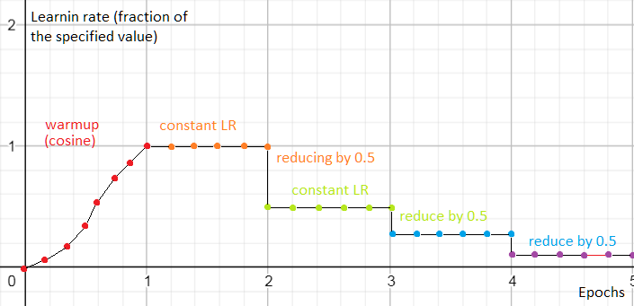

Perforator Shceduler

A simple but useful scheduler inspired by the Cyclic Cosine and many others.

This scheduler uses a two-step plan to find the global minimum:

a) Warmup epoch: set learning rate to zero, then gradually (using cosine curve) raise it to the user-specified value;
b) Cycles: keep LR constant until the metric function improves more than a specified fraction. If it is not improving, restore the last best step and try again;
c) If the metric is not improving, restore the last best step, lower the learning rate by a certain factor and return to step b.

A typical learning graph is below:

